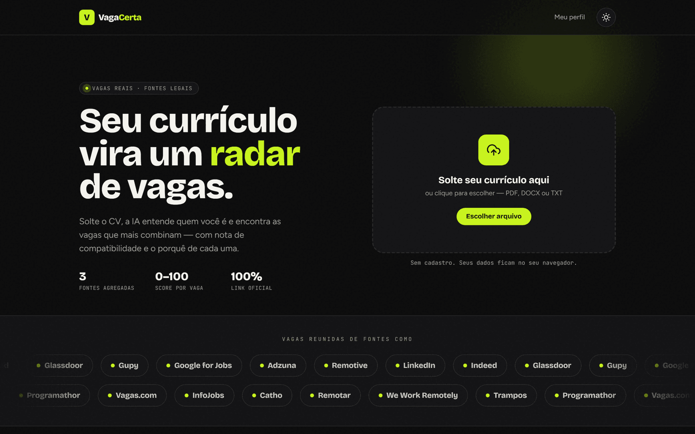
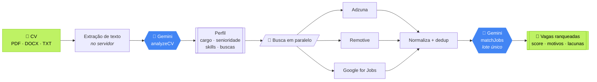
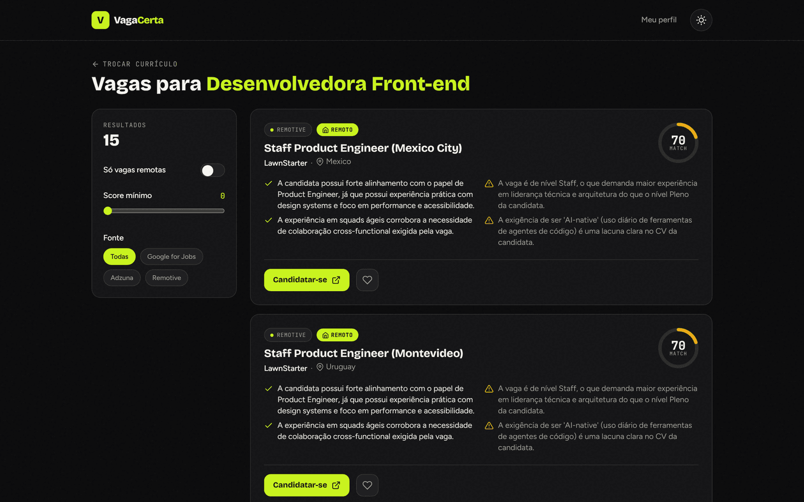
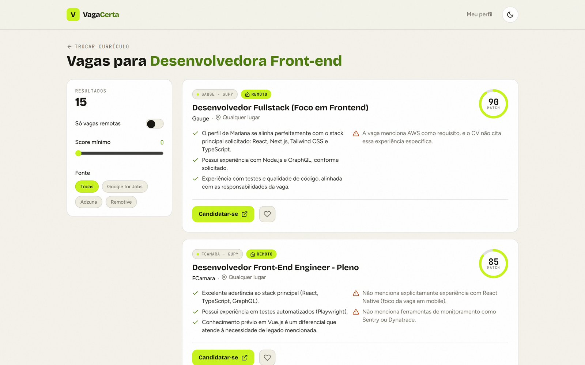
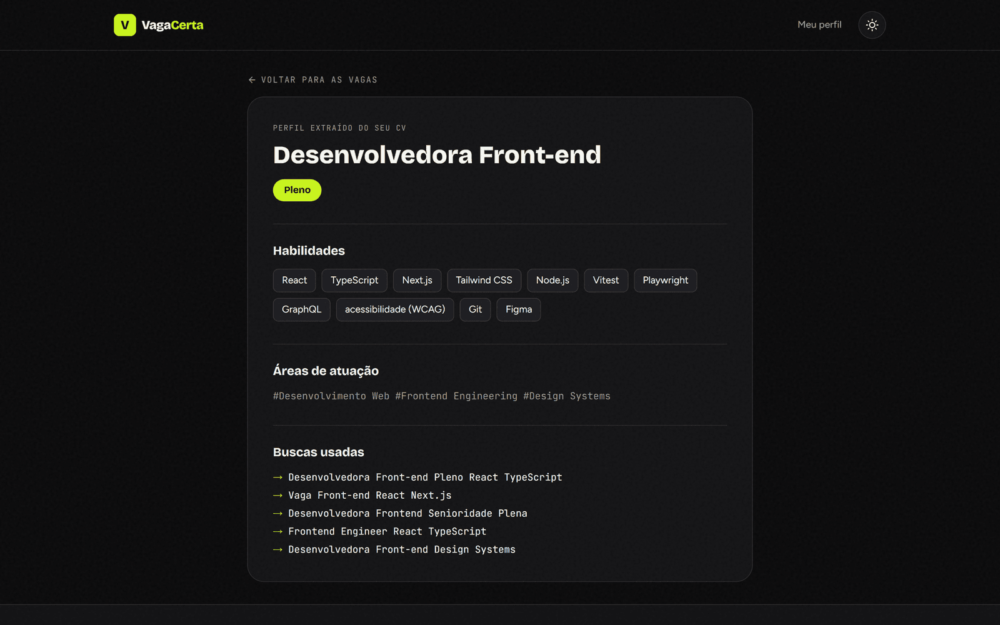
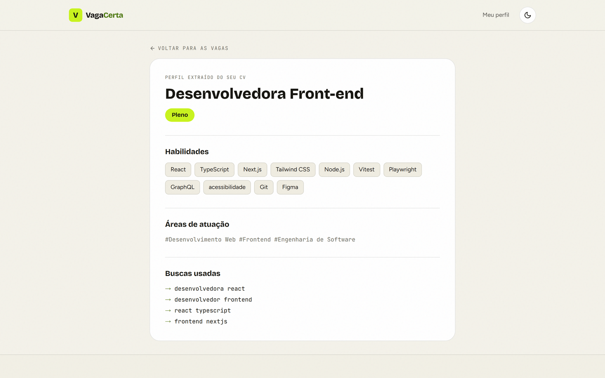

<div align="center">

# 🎯 Vaga Certa

### Seu currículo vira um radar de vagas.

Envie seu CV. A IA entende quem você é, busca **vagas reais** em fontes legais e pontua cada uma —
com os motivos a favor, o que falta no seu perfil e o **link oficial de candidatura**.

<br/>


<br/>

### [🚀 Ver funcionando →](https://vaga-certa-sooty.vercel.app)

<sub>Sem cadastro. Suba um currículo e veja o score.</sub>

<br/>



</div>

<br/>

## O que ele faz

Você solta o currículo. Em poucos segundos:

1. **A IA lê o CV** e extrai cargo, senioridade, habilidades e as melhores buscas para o seu perfil.
2. **Três fontes legais** são consultadas em paralelo — Adzuna, Remotive e Google for Jobs (via JSearch).
3. **Cada vaga recebe uma nota de 0 a 100**, com os motivos a favor e as lacunas do seu CV.
4. Você vai direto ao **link oficial** — sem intermediário, sem cadastro.

> ⚖️ **Nada de scraping.** Só agregadores legais. O Google for Jobs indexa LinkedIn, Indeed,
> Glassdoor e Gupy — e nós sempre levamos você ao anúncio original.

<br/>

## Como funciona



<br/>

## Telas

<table>
<tr>
<td width="50%" align="center"><b>🌙 Escuro</b></td>
<td width="50%" align="center"><b>☀️ Claro</b></td>
</tr>
<tr>
<td></td>
<td></td>
</tr>
<tr>
<td colspan="2" align="center"><sub>Vagas ranqueadas: nota de match, o que combina (✓) e o que falta (⚠), com link oficial.</sub></td>
</tr>
<tr>
<td></td>
<td></td>
</tr>
<tr>
<td colspan="2" align="center"><sub>O perfil que a IA extraiu do seu currículo — e as buscas que ela gerou a partir dele.</sub></td>
</tr>
</table>

<br/>

## Decisões de projeto

Três escolhas que definem o app, todas tomadas com medição — não com palpite.

### 1. Uma chamada para o lote inteiro, não uma por vaga

A primeira versão pontuava cada vaga numa requisição separada. Isso reenviava o **mesmo CV
15 vezes** e estourava o limite do free tier do Gemini (15 req/min) logo na primeira busca:

```
❌ antes:  1 (CV) + 15 (uma por vaga) = 16 requisições → HTTP 429
✅ agora:  1 (CV) + 1  (lote inteiro)  =  2 requisições → 3,8s
```

O `matchJobs` manda o CV uma vez e todas as vagas numeradas, e recebe um array de notas.
A IA responde por **índice**, nunca por `jobId` — índice é verificável, id é convite para alucinação.
A qualidade não mudou: os mesmos scores, o mesmo ranking.

### 2. `gemini-3.1-flash-lite`, medido contra o irmão maior

| | `gemini-3.5-flash` | `gemini-3.1-flash-lite` |
|---|---|---|
| Ler um CV | 16,0s | **1,5s** |
| Pontuar uma vaga | 23,2s | **3,2s** |
| Score (vaga aderente) | 88 | 85 |
| Score (fora da área) | 10 | 15 |
| Sob carga | 🔴 `503 high demand` | ✅ |

Mesmo ranking, mesma separação, **~10x mais rápido**. O modelo maior chegou a recusar
requisições por excesso de demanda.

### 3. O schema zod é a fonte única da verdade

Não há JSON parseado na mão. O schema zod vira JSON Schema (`z.toJSONSchema`), a API é
instruída a responder naquele formato (`responseJsonSchema`), e a resposta **ainda passa pelo
zod** na volta. Se a IA fugir do contrato, estoura ali — não três camadas adiante.

### 4. As buscas da IA precisam ser curtas

Sites de emprego fazem busca **E**: todas as palavras precisam aparecer na vaga. A IA, sozinha,
gerava buscas descritivas e longas — que não retornavam nada:

| Busca gerada | Vagas encontradas |
|---|---:|
| `Desenvolvedora Front-end Pleno React TypeScript` | **1** |
| `front-end react` | **70** |

O prompt agora limita a 3 palavras e proíbe senioridade nas buscas. Parece um detalhe; é a
diferença entre o app achar vagas e não achar.

<br/>

## Arquitetura

```text
app/
  page.tsx                 landing + upload do CV
  resultados/page.tsx      vagas com score + filtros
  perfil/page.tsx          perfil extraído do CV
  api/
    cv/analyze             extrai texto → Gemini devolve o CVProfile
    jobs/search            busca nos providers (paralelo) → normaliza → dedup
    jobs/match             Gemini pontua CV × vagas, em lote único
lib/
  providers/               adapters isolados + agregador
    types.ts               schemas zod — o contrato de tudo
    adzuna · remotive · jsearch
  ai/gemini.ts             analyzeCV + matchJobs (structured outputs, retry)
  cv/parser.ts             extração de texto (PDF · DOCX · TXT · XLSX · RTF…)
  matching.ts              rankJobs — ordena e casa cada nota com sua vaga
  rate-limit.ts            limite por IP nas API Routes
  store.ts                 persistência local (localStorage)
components/                UI própria — sem kit genérico
```

Cada fonte de vaga é um **adapter** que implementa `JobProvider` e devolve o tipo `Job`
unificado. Adicionar uma fonte é criar um arquivo — nada mais no projeto muda.

**As rotas não confiam no cliente:** corpo validado com zod, teto de tamanho de arquivo
no servidor, rate limit por IP e um teto de custo (quantas vagas a IA pontua) separado do
teto de payload (quantas o corpo aceita).

<br/>

## Começar

```bash
git clone https://github.com/cielioqueiroz/buscador-de-cv.git
cd buscador-de-cv

npm install
cp .env.example .env.local   # preencha a GEMINI_API_KEY
npm run dev                  # http://localhost:3000
```

### Variáveis de ambiente

| Variável | Para quê | Onde obter | Obrigatória |
|---|---|---|:---:|
| `GEMINI_API_KEY` | Análise do CV e matching | [aistudio.google.com/apikey](https://aistudio.google.com/apikey) | ✅ |
| `ADZUNA_APP_ID` · `ADZUNA_APP_KEY` | Vagas no Brasil | [developer.adzuna.com](https://developer.adzuna.com) | recomendada |
| `RAPIDAPI_KEY` | Google for Jobs (via JSearch) | [rapidapi.com](https://rapidapi.com) → assine "JSearch" | recomendada |

Só a do Gemini é **obrigatória** — sem ela o app não analisa o CV. As outras duas são gratuitas
e é delas que vêm as vagas brasileiras: o JSearch agrega **Indeed, Gupy, Catho, ProgramaThor,
Talent.com** e outros. Sem elas, sobra só o Remotive (público, mas só vagas remotas
internacionais).

Cada provider degrada com elegância — faltando uma chave, ele retorna vazio e os outros seguem
funcionando.

> 🔒 As chaves ficam **só no servidor** (API Routes) — nunca chegam ao navegador.

<br/>

## Scripts

```bash
npm run dev      # desenvolvimento
npm run build    # build de produção
npm start        # serve o build
npm test         # 41 testes (Vitest)
npm run lint     # ESLint
```

Os testes cobrem os adapters, o parser, o agregador, as guardas das rotas, o retry do Gemini
e o matching em lote — com as APIs externas mockadas. **Nenhum teste gasta chamada de IA.**

<br/>

## Roadmap

- [ ] Login e sincronização entre dispositivos (Supabase)
- [ ] Gerar carta de apresentação e adaptar o CV por vaga
- [ ] Tracker de candidaturas (kanban: Aplicado → Entrevista → Oferta)
- [ ] Alertas por e-mail de vagas novas com bom score
- [ ] Relatório "como melhorar seu CV"

<br/>

## Licença

[MIT](LICENSE) — use, modifique, publique.

<div align="center">
<br/>
<sub><b>Todo talento merece a vaga certa.</b></sub>
</div>
